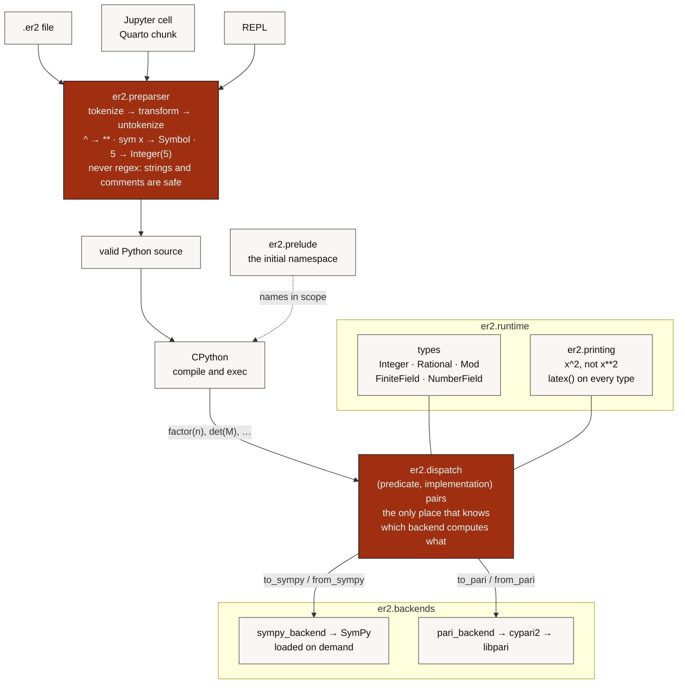

# ER2 — Architecture

> Technical design document. The original idea is summarized in §1; the draft it came from is kept
> locally (`draft/`, ignored by Git).
> Status: **0.4.2** released (M1–M4 done; M3 was the MVP).
> **M5 (0.5, algebra) and M6 (0.6, series) are complete**, acceptances included.
> See [PLAN.md](PLAN.md).

## 1. What ER2 is

The name honors the Hungarian mathematician **Paul Erdős** — in Spanish, "Erdős" is pronounced like "ER-dos", i.e. *ER2*.

ER2 is **mathematical Python**: a superset of Python that adds symbolic syntax
(`sym x`, `x^2`, `_x`), exact arithmetic by default, and transparent access to PARI/GP.

**A goal of ER2 is writing scientific articles in it** (§1.3): a paper whose results are computed
by the document that states them.

It is neither a new language nor a new interpreter. In the 0.x releases, ER2 is:

1. a **source-to-source preparser** (`.er2` → valid Python),
2. a **runtime** (the `er2` package) that defines mathematical types and functions,
3. a set of **backends** (SymPy for symbolic work, PARI via cypari2 for number theory).

The generated code runs on unmodified CPython. A CPython fork is only considered for 2.0 (see §9).

Direct precedent: the SageMath *preparser* does exactly this
(`^`→`**`, integer literals wrapped in `Integer`). Study it before reinventing it.

## 1.1 Python compatibility contract

**Hard requirement:** ER2 must accept Python syntax without problems and give full access to the
Python ecosystem through ordinary `import`. Chosen model: **the SageMath model** (decided 2026-09-18).

1. **Only ER2 sources are preparsed**: `.er2` files, the `er2` REPL, and notebook cells with the ER2
   extension loaded. Every `.py` module and every installed library (NumPy, pandas, SciPy,
   Matplotlib, …) runs as plain, untouched Python.
2. **Imports are standard.** `import numpy as np` inside a `.er2` file uses Python's normal import
   system. The ER2 import support adds a `FileFinder` path hook that checks Python's own suffixes
   first and `.er2` last. A `.py` module therefore always wins over an `.er2` module with the same
   name. Python's default hook stays in place behind it.
3. **Every Python construct is valid ER2**: classes, decorators, generators, `async`, `match`,
   comprehensions, f-strings, type hints, `with`, exceptions, `if __name__ == "__main__"`, … The
   preparser rewrites tokens, never syntax structure, so anything `ast.parse` accepts after
   preparsing keeps its Python meaning.
4. **The only semantic differences inside `.er2` sources** are, deliberately and exhaustively:

   | Construct   | Python                 | ER2                                  |
   |-------------|------------------------|--------------------------------------|
   | `a ^ b`     | XOR                    | power (`a ** b`)                     |
   | `a ^^ b`    | syntax error           | XOR (Python's `a ^ b`)               |
   | `a ^= b`    | XOR-assign             | power-assign (`a **= b`)             |
   | `a ^^= b`   | syntax error           | XOR-assign                           |
   | int literal | `int`                  | ER2 `Integer` (exact), so `1/3` is the rational 1/3 |
   | `sym x, y`  | syntax error           | symbol declaration                   |
   | `5r`        | syntax error           | raw literal: the plain Python `int` 5 (added 2026-09-19) |

   Anything not in this table behaves exactly as in Python. Adding a row requires updating this
   contract.
5. **Values cross into the ecosystem transparently.** ER2 numbers implement `__index__`,
   `__int__`, `__float__`, `__complex__`, `__hash__` (equal to the corresponding `int` hash) and
   compare equal to Python numbers, so `range(n)`, `lst[n]`, `np.zeros(n)`, `math.sqrt(n)`,
   dict keys and `json` keep working. See D6 for `isinstance(n, int)`.
   This holds fully for `Integer`, which subclasses `int`, so NumPy gives it a real dtype
   (`np.array([2^3, 3^2]).dtype` is `int64`). `Rational` has no NumPy dtype and lands in an
   **object array** instead. That is the right answer rather than a gap: a `float64` array would
   silently drop the exactness ER2 exists to keep, so `1/3` stays `1/3` and the user asks for
   `float(...)` when they want speed. `tests/compat/test_scientific.py` pins both behaviours, and
   is skipped unless NumPy is installed (CI installs it).
6. **Escape hatches**: `int(...)`/`float(...)` for explicit conversion, and the raw-literal suffix
   `5r` (Sage's convention) for a plain Python `int` (implemented 2026-09-19, user decision), for
   example in hot numeric loops (D2). It works for every integer literal (`0x1Fr`, `1_000r`); there
   must be no space before the `r`. An operation with an ER2 number gives an ER2 result, as in
   Sage: `5r / 2` is `5/2`, while `5r / 2r` is Python's `2.5`.
7. **Known caveat**: Python code pasted into a `.er2` file that relies on `^` being XOR, or on
   `int / int` returning `float`, changes meaning. Mitigations: the preparser warns on `^` between
   obvious bitmask operands (hex/binary literals, `&`, `|`, `<<` in the same expression); keep such
   code in `.py` modules and import it.

A dedicated **compatibility test suite** (`tests/compat/`) enforces this contract: plain Python
snippets whose behavior must be identical under ER2, imports of stdlib/third-party modules from
`.er2` code, and ER2 values passed into library functions.

## 1.2 Notebooks: Jupyter and Quarto

**Hard requirement:** ER2 code must run in Jupyter notebooks and in Quarto documents (`.qmd`).
Both use Jupyter kernels, so a single mechanism covers both: register the ER2 preparser as an
IPython input transformer (`shell.input_transformers_post`). IPython runs its own transforms first
(magics `%`, `!`, `?`), so the ER2 preparser receives valid, tokenizable Python.

There are two supported routes, and both were verified with a prototype on 2026-09-18 (Quarto
1.9.38, ipykernel, `print(2^10)` → `1024`):

| Route | Jupyter | Quarto |
|-------|---------|--------|
| **A. `er2` kernel**: an `IPythonKernel` subclass that installs the transformer at startup. Installed with `er2 kernel install`. | Select the "ER2" kernel | Front matter `jupyter: er2`, code cells `` ```{python} `` |
| **B. Extension**: `%load_ext er2` in a standard `python3` kernel | First cell `%load_ext er2` | Same, as the first `` ```{python} `` cell |

Details:
- **Kernelspec language (D9): `python`, and cells are `` ```{python} ``.** So syntax
  highlighting, the VS Code Quarto extension and editor tooling work unchanged, since ER2 is a
  Python superset. `language_info.file_extension` is `.er2`.
  **Correction (2026-09-20).** An earlier version of this note said Quarto also accepted
  `"language": "er2"` with `` ```{er2} `` cells. **It does not**, and the claim was retested on
  the same Quarto (1.9.38): with the kernelspec declaring `er2`, a `` ```{er2} `` block is
  copied into the output as literal text and never executed, while a `` ```{python} `` block in
  the same document runs on the ER2 kernel. The render still exits 0, so the failure is silent —
  the same shape as the Agg figure in §1.3. Quarto decides what is executable from the block's
  language before the kernel is consulted, and its Jupyter engine recognises a fixed set.
  Quarto's own developer notes confirm the mechanism
  ([dev-notes, 2026-03-04](https://quarto-dev.github.io/dev-notes/posts/2026-03-04/)): a block's
  language is claimed by an **engine**, through `claimsLanguage`, and there is no mapping from a
  language name to a Jupyter kernelspec. Supporting `` ```{er2} `` therefore means shipping a
  Quarto **engine extension** (`quarto create extension engine` scaffolds one; the bundled
  `julia-engine` is `_extension.yml` plus ~1,300 lines of JavaScript that delegate to a separate
  Julia package). Since we would need Jupyter to do the executing, that extension would be a
  reimplementation of Quarto's Jupyter engine, pinned to an API at version 0.1.0, installed per
  project, and it would lose exactly the editor tooling D9 chose `python` for.

  **What ER2 ships instead (2026-09-20).** Cells stay `` ```{python} ``, and two files beside
  the examples make a rendered document say ER2:

  - `examples/er2-cells.lua`, a Lua filter that renames the displayed language of every
    executable Python block to `er2` and marks the cell div. No per-cell marker is needed,
    because in a document with `jupyter: er2` every executable Python block **is** ER2.
  - `examples/er2.xml`, a KDE syntax definition that highlights it. It states only the §1.1
    table — `sym`, the `5r` raw literals, `^^` — and then `IncludeRules context="##Python"`,
    so Python's keywords, builtins, strings and f-strings are Pandoc's own and cannot drift.
    `sym` inside a string or a comment is not highlighted, the rule the preparser also follows.

  Both are switched on for every example by `examples/_quarto.yml`, four lines in one place, so
  no document's front matter carries them. `tests/notebooks/test_notebooks.py` renders one
  example to HTML and asserts the language is `er2`, that no block is left `python`, that `sym`
  is a keyword and that token spans exist at all; removing any of the three pieces fails it.

  **Why not the alternatives.** All measured on Quarto 1.9.38:

  | Approach | Executes | Output says ER2 | Highlighting | Typing |
  |---|---|---|---|---|
  | `` ```{python} `` alone | yes | no | Python's | none |
  | `` ```{er2} ``, `` ```{.er} `` | **no, silently** | — | — | none |
  | `` ```{python .er2} `` | yes | no — Quarto eats the class | Python's | 6 chars × every cell |
  | `` ```{python} `` + `#| classes: er2` | yes | via CSS only | Python's | a line × every cell |
  | **`` ```{python} `` + filter + `er2.xml`** | **yes** | **yes** | **ER2's** | **none** |

  `` ```{python .er2} `` is the `firstClass` mechanism the dev note describes for
  `` ```{python .marimo} ``. It executes, but the class never reaches pandoc — a logging filter
  sees `[python, cell-code]` — so it is a comment to a human reader and nothing more.

  **A Lua filter cannot make a block execute, only relabel it.** Quarto runs Lua filters in the
  pandoc stage, *after* the kernel has run: a logging filter put its first line 20 log lines
  after `Executing 'doc.quarto_ipynb'`. So a filter that rewrites `` ```{.er} `` to `python`
  produces a block that is *labelled* Python and has **no output** — the worst outcome, because
  it looks like a cell that legitimately printed nothing. (Two parsing details: `` ```{.er} ``
  reaches the filter as `classes[1] == "er"`, while `` ```{er} `` reaches it as a class named
  literally `{er}`.) Relabelling without `er2.xml` was also measured, and loses every
  `sourceCode` class and token span, because Pandoc has no `er2` lexer — which is why the
  syntax definition is part of the answer and not a refinement of it.

  **There is no alias mechanism**, no config key that makes `` ```{er2} `` *mean*
  `` ```{python .er2} ``. The nearest thing, a project `pre-render` script that rewrites the
  blocks, was tested and works — it also **rewrites the author's `.qmd` in place**, so after one
  render the source no longer says `` ```{er2} `` and the alias has erased itself. Restoring it
  in `post-render` leaves the sources rewritten whenever a render fails, and fights
  `quarto preview`, which re-renders continuously. It also does nothing for the editor, which is
  what D9 was protecting.
- **Rich output.** ER2 objects implement `_repr_latex_` (§3.6). Checked 2026-09-18: a cell that
  evaluates to an expression renders as MathJax in Quarto HTML.
- **Inline math in Quarto.** `` `{python} latex(f)` `` in text renders as inline math, because
  `Tex._repr_markdown_` returns `$…$`. A plain `str` does not work, because Quarto escapes its braces
  (`x^\{2\}`); this was checked.
- **Inline expressions skip the input transformers.** Quarto evaluates `` `{python} …` `` through
  ipykernel's `user_expressions`, not through cell execution. The **`er2` kernel** therefore
  preparses `user_expressions` in `do_execute` as well; this was checked, and `x^2` works inline.
  With **route B** (`%load_ext er2`) that is not possible, so inline expressions must use Python
  syntax (`x**2`). Document this in the user guide.
- **Development note.** Quarto keeps a kernel daemon running. After changing the kernel, use
  `quarto render --execute-daemon-restart`.
- **Tracebacks** point at the right cell line because the preparser preserves line numbers.
- **Dependencies.** `ipykernel` is an optional extra (`er2[jupyter]`) and is not a core
  dependency. Quarto is an external tool and is not a Python dependency.
- **Tests.** Execute `examples/mvp.ipynb` through both routes (`nbclient`). Render
  `examples/mvp.qmd` with Quarto when it is installed; otherwise skip that test.

## 1.3 Scientific articles

**Goal (stated 2026-09-20):** a mathematician should be able to write a paper in ER2, where the
numbers, the formulas and the figures in the text are produced by the text itself. A result and
its proof-of-computation stop drifting apart, because there is only one document.

This is not a new subsystem; it is what the existing hard requirements are for, seen from the
author's side:

| What an article needs | What ER2 already has |
|---|---|
| Executable prose | Quarto with the `er2` kernel (§1.2), HTML and PDF, both tested |
| Formulas in the running text | `` `{python} latex(f)` `` renders as inline math (§1.2) |
| Every result as mathematics, not as `repr` | `latex()` on every type, a hard requirement (§3.6) |
| Exact numbers in the text | Exact arithmetic by default (§1.1) |
| Citing a sequence | `OEISSequence.bibtex()` (§10) |
| Citing ER2 itself | `CITATION.cff` |
| Figures | Matplotlib, through ordinary `import` (§1.1 point 5) |

What the goal adds is an obligation: **every one of those has to keep working together**, which
only a whole article exercises. The measure is `examples/article.qmd` — a small but real paper,
rendered to PDF in CI — not a list of features.

Two consequences for design decisions:

- A result's LaTeX is part of the public API, not a debugging convenience. Changing how a type
  renders changes published papers.
- Figures mean ER2 values must reach Matplotlib, which is why `tests/compat/test_scientific.py`
  guards the number contract against NumPy and Matplotlib rather than trusting it.

## 1.4 Learnable in an afternoon by a Python programmer

**Goal (stated 2026-09-20):** someone who knows Python should be able to use ER2 without
learning a language. This is the same principle as §1.1 ("do not create a new language
unnecessarily") stated as a target for the *user's* effort rather than for the implementation.

The whole of what has to be learned is the §1.1 table — five differences — plus the names of the
mathematical functions:

| To learn | Size |
|---|---|
| `^` is a power, `^^` is XOR | 2 lines |
| Integer literals are exact, `1/3` is a fraction | 1 line |
| `sym x, y` declares symbols | 1 line |
| `5r` is a raw Python literal | 1 line, rarely needed |
| Function names | a lookup, not a study: `docs/PARI_FUNCTIONS.md` |

Everything else is Python, and that is enforced rather than promised (`tests/compat/`).

What the goal rules out, in order of how tempting they are:

- **A second way to write something Python can already write.** New syntax needs the §1.1 table
  amended and the user asked, and the bar is that Python is *unnatural* for it, not merely longer.
- **Names a Python programmer must translate.** ER2 names follow PEP 8 and mathematical usage,
  not PARI's abbreviations (D5, D8): `dedekind_psi`, not `psi`; `bigomega`, not `Omega`.
- **A backend the user has to choose.** Which engine runs a call is ER2's problem (§2.1). A user
  who has to know when to reach for PARI has been handed the implementation to learn.
- **Error messages in the vocabulary of the backend.** A PARI error about a `t_POLMOD` teaches
  the user about PARI, which is exactly what they should not have to learn.

The measure is that the reference manual for the *language* is short. §1.1's table is it; when it
grows, this goal is being spent.

## 1.5 Speed: faster than SymPy, close to PARI

**Goal (stated 2026-09-20):** ER2 should be faster than SymPy for the work it dispatches, and
using PARI through ER2 should cost little beyond PARI itself — a small dispatch cost, not a
new order of magnitude.

Measured in `docs/BENCHMARKS.md`, regenerated by `benchmarks/run.py`. Stating the goal as two
different comparisons is deliberate, because the two are not the same promise:

| Comparison | What it means | Status |
|---|---|---|
| ER2 vs SymPy | the user's own alternative: what they would otherwise have written | met on every benchmark that reaches PARI: ×0.01–0.73, i.e. 1.4× to 100× faster |
| ER2 vs cypari2 | the tax ER2 charges on the engine it chose | met for numbers (×1.0–1.8); **not** met for structured types: ×2–17 for matrices, up to ×47 for a small polynomial over F_p (§2.1) |

The honest form of the second row is §2.1. The short version: **dispatch is cheap and conversion
is not**, and conflating them hides where the time goes. A number reaches PARI in under a
microsecond of ER2's own work; a matrix or a polynomial has to be rebuilt in PARI's
representation, and that rebuilding, not the choice of backend, is most of what ER2 adds.

Two standing consequences:

- **Never quote the backend's ratio as ER2's.** PARI's `factormod` is ×131 faster than SymPy at
  degree 12, which is not a number any user will experience; ER2 end to end is ×2.8, and that is
  the one that is true for them.
- **A backend that loses is a bug in ER2, not a fact about the backend.** `hermite_form` at
  10×10 was ×3.3 slower than SymPy's, and the recorded plan was to add a size threshold to
  dispatch. Measuring first showed the conversion, not PARI, was the cost; fixing that made it
  ×1.4 faster and the threshold unnecessary (§3.4).

## 2. Overview



Read the diagram as two separate claims. **Left to right is syntax**: everything the preparser
does is finished before CPython sees the code, so ER2 is Python by the time it runs (§1.1).
**Top to bottom is semantics**: a public name resolves through one dispatch table to one backend,
and the conversion arrows are the only places a foreign object exists (§3.7).

Backends never call each other; they do not know each other exists. That is what lets §1.5's
promise be stated per call — each call has exactly one engine and one conversion.

<details>
<summary>The same diagram as plain text, for readers without Mermaid</summary>

```text
 .er2 source / Jupyter cell / REPL
              │
              ▼
 ┌─────────────────────────────┐
 │ er2.preparser               │  tokenize → transform tokens → untokenize
 │  - sym x, y   → assignments │  (NO regex over raw text: respects strings,
 │  - ^          → **          │   comments, f-strings)
 │  - literals   → Integer(…)  │
 └──────────────┬──────────────┘
                ▼
        valid Python (str)  ──►  ast.parse / compile  ──►  CPython
                                                               │
                        initial namespace = er2.prelude  ◄─────┘
                                        │
 ┌──────────────────────────────────────┴────────────────────────┐
 │ er2.runtime                                                    │
 │  types: Integer, Rational, Symbol, Expr, …                     │
 │  public functions: factor, expand, diff, isprime, phi, …       │
 │  er2.dispatch: picks a backend based on argument type          │
 │  er2.printing: mathematical output (x^2, not x**2)             │
 └───────────────┬────────────────────────────┬───────────────────┘
                 ▼                            ▼
     er2.backends.sympy            er2.backends.pari
          SymPy                  cypari2 → libpari
```

</details>

## 2.1 Where the time goes

§1.5 promises a small dispatch cost. This section is what "small" means, and it separates the two
costs that get confused with each other.

A public call does four things, and only the first is dispatch:

1. **Choose a backend** — run predicates until one accepts. No mathematics, no allocation.
2. **Convert the arguments** into PARI's representation.
3. **Compute** — the backend does the work.
4. **Convert the result** back into an ER2 or SymPy object.

Measured separately, in one run, in microseconds (the `docs/BENCHMARKS.md` "Dispatch overhead"
section keeps the first column honest across releases):

| Call | Choose | Convert in | Compute | Convert out | Whole |
|---|---|---|---|---|---|
| `phi(n)`, n ≈ 10⁸ | 0.3 | ~0 | 2.5 | 0.5 | 4.5 |
| `det`, 10×10 over Z | 1.4 | 79 | 12 | 0.5 | 100 |
| `kernel`, 10×10 over Z | 1.0 | 81 | 12 | 13 | 127 |
| `factor`, degree 4 over Q | 77 | 101 | 54 | 184 | 458 |

**Conversion, not computation, is where ER2's time goes** — 80% of a matrix call, and for
`factor` the two conversions together are more than five times the factoring. That is the
governing fact about ER2's performance, and why a matrix or polynomial call costs a multiple of
the raw PARI call while a number call does not: `phi(n)` converts one integer, `det(M)` converts
a hundred, and `factor` has to rebuild SymPy's exact expression from PARI's factor matrix.

Three rules follow, every one of them arrived at by measuring rather than by reasoning — and
every one of them found a claim in this document that was false:

- **A predicate must not do work proportional to the data.** Scanning a 10×10 matrix's entries
  to ask "is this over Q?" cost 135 µs — ten times the PARI call it was deciding about, and more
  than the conversion. SymPy already stores the answer: a `Matrix` holds a `DomainMatrix` tagged
  with a domain, so `is_ZZ or is_QQ` answers in constant time (`dispatch.matrix_domain`). That
  took the choice from 135 µs to 1.5 µs. The shortcut is sound one way only — a domain of
  `EXRAW` does not prove the entries are irrational, because assigning an integer into a
  symbolic matrix leaves the domain alone — so a domain that does not answer falls back to the
  scan, and a test pins that case.
- **Convert beneath SymPy's object layer where the domain allows it.** Reading entries out of
  the `DomainMatrix` as plain `int`s skips building the intermediate `sympy.Integer` objects and
  costs about a tenth of `Matrix.flat()`. Together the two changes made `det` on a 10×10 ×5.8
  faster (642 µs → 111 µs), without touching a line of mathematics.
- **Do not ask a general question when a specific one is being asked.** Converting a polynomial
  called `sympy.together` to split a rational function into a numerator and a denominator —
  three quarters of the conversion, spent establishing that the denominator is 1. A univariate
  polynomial over Q now goes straight to PARI's `Pol`, one call rather than one per term. That,
  with the predicate no longer walking the expression twice, made `factor` at degree 4 ×2.7
  faster and turned it from ×1.23 slower than SymPy into ×0.46.

The first two read SymPy's private `_rep`. That is a deliberate, contained bet: each reader is a
`getattr` with a fallback to the public path, so a rename costs speed and not correctness.

What is left is other people's code and a duplicated step of our own:

- Rebuilding SymPy's exact expression from PARI's factor matrix is now the single largest cost
  of `factor` (184 µs of 458). It is ours, and it is the obvious next thing to measure.
- `PARI.matrix` is now ~80 µs of the 100 µs a 10×10 conversion costs, and is cypari2's.
- The predicate and the converter each build a `sympy.Poly` of the same expression, about 55 µs
  twice. Handing the `Poly` from one to the other would cross the boundary dispatch exists to
  keep — a predicate decides, it does not produce — so this needs a design decision, not a
  patch.

## 3. Components

### 3.1 Preparser (`er2/preparser.py`)

Input: ER2 text. Output: equivalent Python text. A pure, stateless function that is easy to test
with input/output pairs.

Transformations (0.1):

| ER2                | Generated Python                                  | Notes |
|--------------------|---------------------------------------------------|-------|
| `sym x, y`         | `x, y = __er2_sym__("x, y")`                      | at the start of a statement, or after `;` or `:` (soft keyword, D4) |
| `x^2`              | `x**2`                                            | see D1 |
| `a ^^ b`           | `a ^ b`                                           | explicit XOR (Sage convention) |
| `5`                | `__er2_int__(5)`                                  | so `1/3` is `Rational(1, 3)`; see D2 and D6 |
| `5r`               | `5`                                               | a plain `int`, not wrapped (§1.1 point 6) |
| `f"{2^3=}"`        | `f"2^3={2**__er2_int__(3)!r}"`                    | self-documenting f-strings echo the ER2 text |
| `_x`               | unchanged; `_x` lives in the prelude              | see D3 |

The helpers use reserved dunder names (`__er2_int__`, `__er2_sym__`), so user code such as
`from sympy import *` can never shadow them. `er2 --show-python` shows them as they are.

Integer literals inside `case` patterns stay as they are (fixed in M4). A literal pattern
compares with `==`, so it needs no `Integer`, and `case __er2_int__(0):` would be a class
pattern. The preparser applies the `^` and `sym` edits first, parses the result with `ast` to
find the pattern spans, and then wraps every other literal. Guards (`case n if n > 2`) are
ordinary expressions and are wrapped.

Requirements (all implemented in M1 and covered by `tests/preparser/`):
- Built on the `tokenize` module; never touch the contents of strings or comments. In f-strings
  (Python ≥ 3.12), only the expressions inside `{…}` are code, and the literal text is untouched.
- Must preserve line numbers (errors must point at the line in the `.er2` file).
- Idempotent on plain Python that uses neither `^` nor `sym`.
- `er2 --show-python file.er2` must print the generated Python (for debugging).

### 3.2 Entry points

- **CLI**: `er2 file.er2` and the `er2` REPL (built on `code.InteractiveConsole` plus the preparser).
- **Import support** (`er2/importer.py`): `import module` finds `module.er2`, and
  `pkg/__init__.er2` makes a regular package. This uses a `FileFinder` path hook, not a meta-path
  finder: a meta-path finder placed after Python's own is too late for packages, because Python
  already claims the directory as a namespace package. No bytecode is cached.
- **Jupyter / Quarto** (§1.2): the `er2` kernel (`er2 kernel install`) and the `%load_ext er2`
  extension (`er2/session.py`). Both register the preparser in `input_transformers_post`. They also:
  - restore the prelude before every cell, because Quarto runs `%reset`, which would otherwise
    delete `__er2_int__` (found in M1);
  - make IPython tracebacks show the ER2 cell rather than the preparsed one.
- **`er2 file.er2` puts the file's directory first on `sys.path`**, as `python file.py` does, so
  modules next to the program can be imported (fixed in 0.4.1).
- **Tracebacks in the CLI** hide the runner frames and the ER2 runtime frames. They drop the
  column markers for `.er2` frames, because those columns refer to the preparsed line.

All of them share `er2.preparser` and `er2.prelude`; none of them contains its own translation logic.

### 3.3 Runtime and prelude (`er2/runtime/`, `er2/prelude.py`)

`prelude` defines the initial namespace: types, public functions, and the symbols `_x, _y, _z, _n, _k, _p`.

Since M2 the prelude also holds the CAS functions from `er2.dispatch` (`expand`, `factor`,
`simplify`, `collect`, `cancel`, `diff`, `integrate`, `limit`, `solve`, `series`). It also holds
a small set of SymPy names, exposed unchanged: `pi, E, I, oo, sqrt, exp, log, sin, cos, tan, Eq`,
and `Matrix` (M5, D12).  `GF` (M5, D13) creates finite fields; like the other ER2 types it needs
no SymPy, which is only loaded by `FiniteField.modulus()`.
Like every prelude name, they are defaults: an assignment or an import (`from math import *`)
shadows them, as in Python.

**Lazy SymPy (0.4.1).** Importing SymPy takes about 0.3 s, which was most of a program's
startup. ER2 modules never import SymPy at module level; they go through `er2._lazy`:
- `sympy()` imports it on demand.
- `sympy_loaded()` short-circuits type checks, because no SymPy object can exist before SymPy is
  loaded.
- `when_sympy_loaded(hook)` installs ER2's printer (D11) the moment SymPy is imported, even by
  user code (`import sympy`).
- For a file or an `.er2` module, the prelude includes its SymPy values (`pi`, `sin`, `_x`, …)
  only if the compiled code names one of them, or uses `eval`, `exec`, `globals`, `vars`,
  `locals` or `__import__`, which can reach names that are not written in the code.
- The REPL and notebooks get the full prelude.

A number theory program now starts in about 0.16 s instead of 0.4 s (docs/BENCHMARKS.md).

Since 0.4.2 the prelude also has `oeis` (§10); it loads nothing until an OEIS function is called.

Since M3 the prelude holds the curated PARI functions (the `prelude` rows of §3.5, D10),
`factorial` (exact, from SymPy), `dedekind_psi` (D5), the types `Mod` and `Factorization`, and the
`pari` namespace.

Canonical integer type: **exactly one** on the ER2 side (see D6; must satisfy the compatibility
contract in §1.1). Requirements: `__index__` (so that `range`, indexing, and slicing keep working),
lossless conversion to/from `cypari2.gen` and to/from `int`.

### 3.4 Dispatch (`er2/dispatch.py`)

Public functions are generic and choose a backend by type:

```text
factor(n: integer or rational)          → PARI  factor → Factorization
factor(p: univariate polynomial over Q) → PARI  factor → SymPy expression (M4)
factor(p: any other Expr, or options)   → SymPy factor
gcd(a, b), lcm(a, b)                    → SymPy for expressions, PARI for numbers
isprime(n)                              → PARI  isprime (proof)
det, inverse, rank, kernel, charpoly,
  minpoly, solve(A, b) of a matrix over Q → PARI  (matdet, M^-1, matrank, matker, …)
the same, other entries (symbols, floats) → SymPy matrix methods
hermite_form, smith_form (matrix over Z) → PARI  mathnf, matsnf
factor(f, modulus=p), gcd(f, g, modulus=p) → PARI  factormod, gcd over F_p
isirreducible(f), isirreducible(f, modulus=p) → PARI  polisirreducible
resultant(f, g, x), discriminant(f, x)
  with f, g polynomials over Q in x     → PARI  polresultant, poldisc
the same, symbolic coefficients         → SymPy resultant, discriminant
groebner(F, *gens), reduce(f, G)        → SymPy groebner, reduced (PARI has none)
NumberField(f): nf, bnf, ideals        → PARI  nfinit, bnfinit, idealprimedec
echelon_form(M)                         → SymPy rref
expand(s * t), s, t truncated series    → PARI  t_SER arithmetic (M6)
expand(anything else)                   → SymPy expand
minpoly(algebraic number)               → SymPy minimal_polynomial
```

- The dispatch table lives in a single place, not scattered across functions. Each entry is a
  list of `(predicate, implementation)` pairs; a predicate sees the positional and keyword
  arguments.
- **Automatic backend choice (M4).** A univariate polynomial with rational coefficients and no
  options goes to PARI. That is ×2–25 faster than SymPy at every degree measured, from 2 to 60
  (docs/BENCHMARKS.md). It used to be slower below degree 9, because of the conversion rather
  than the factoring; §2.1 records how that went away. The result is rebuilt in SymPy's
  own form (SymPy's `_keep_coeff`), so it is the same expression `sympy.factor` returns; a test
  checks this, and it was also compared on 248 random polynomials. Multivariate polynomials,
  irrational coefficients and options (`extension=`, `modulus=`, …) stay with SymPy.
- **Polynomials over F_p (M5).** `factor(f, modulus=p)` and `gcd(f, g, modulus=p)` go to PARI for
  univariate polynomials over Z with prime `p`, and the
  result is rebuilt in SymPy's exact form: the integer content in front (not reduced modulo `p`,
  as SymPy leaves it), then monic factors with coefficients in `(-p/2, p/2]`. Checked against
  `sympy.factor(f, modulus=p)` on 400 random polynomials. `domain=GF(p)` is the same as
  `modulus=p`. Polynomials over `GF(p^k)` with `k > 1` would need coefficients that are field
  elements, which no ER2 type provides yet: `factor(f, domain=GF(9))` raises
  `NotImplementedError` and points to `pari.raw.factormod`. `isirreducible` follows PARI in
  answering False for a constant, where SymPy answers True.
- **What the M5 backends actually buy (docs/BENCHMARKS.md).** The PARI route wins where the work
  is big enough to pay for converting a SymPy object to PARI and back. Every linear algebra
  operation is now faster than SymPy at both sizes measured — `det` at 20×20 by ×100
  (519 µs against 41.8 ms), `hermite_form` at 10×10 by ×1.4 — and so is every polynomial
  benchmark: `factor` by ×2–25 from degree 2 to 60, `factor(f, modulus=p)` by ×3–6.
  **This was not always true, and how it became true is the lesson.** `hermite_form` at 10×10 used
  to be ×3.3 *slower* than SymPy's `hermite_normal_form`, and this paragraph proposed a size
  threshold in dispatch, as `factor` has for degree. That would have been the wrong fix: the cost
  was never PARI's, it was the conversion around it (§2.1). Making the conversion cheap turned
  ×3.3 slower into ×1.4 faster and removed the need for a threshold at all. Before adding a
  rule about *when* to use a backend, measure whether the backend is really what is slow.
  The gap between the PARI call and the whole ER2 call is still wide — `factormod` alone is
  ×32–131 faster than SymPy where ER2 end to end is ×3–6 — so quote the end-to-end figures,
  which are what a user sees.
- **Linear algebra (M5, D12).** Matrices are SymPy's `Matrix`. A matrix whose entries are all
  rational goes to PARI (square matrices only for `det`, `inverse`, `charpoly`, `minpoly` and
  `solve`); every other matrix goes to SymPy, which also raises the errors for non-square
  input. Both routes give the same results, checked on random matrices, and raise the same
  SymPy exceptions (`NonInvertibleMatrixError`, `NonSquareMatrixError`). Conventions:
  `kernel` is the right kernel, given as column matrices in reduced echelon form (Sage's
  echelonized basis), so the basis does not depend on the backend; `hermite_form` is PARI's
  column-style HNF, which equals SymPy's `hermite_normal_form`; `smith_form` is a diagonal
  matrix of the input's shape with `d_1 | d_2 | …`, as SymPy's `smith_normal_form` (PARI's
  `matsnf` lists them the other way round). `solve(A, b)` is a linear system only when `b` is a
  `Matrix`; with lists, `solve` keeps SymPy's meaning (`solve([x + y - 1, x - y], [x, y])`).
- **Resultants (M5, D16).** `resultant(f, g, x)` and `discriminant(f, x)` go to PARI when `f` and
  `g` are polynomials over Q in `x` alone (a constant counts); anything else, symbolic
  coefficients included, goes to SymPy. The variable may be left out when the arguments have a
  single variable between them. ER2 follows the standard sign convention, PARI's, so
  `resultant(x - 1, x^3 - 8, x)` is `-7` where `sympy.resultant` answers `7`; the SymPy route
  puts back the `(-1)^(deg f · deg g)` that SymPy drops when it reorders the arguments. The two
  routes were compared on 200 random polynomials over Q and 40 with symbolic coefficients.
- **Gröbner bases (M5, D17).** SymPy only: PARI has none. `groebner(F, *gens, order="lex")`
  returns SymPy's `GroebnerBasis`, which ER2's printer already writes in `^` notation, because
  SymPy prints a basis through `_print_Add` and `ER2StrPrinter` overrides `_print_Pow`.
  `reduce(f, G)` is the remainder of `f` modulo `G` — its normal form when `G` is a Gröbner
  basis, so `reduce(f, G) == 0` is membership of the ideal. **`f in G` is not**: SymPy's
  `GroebnerBasis` defines `__iter__` and no `__contains__`, so Python's `in` asks whether `f` is
  one of the basis polynomials. `G.contains(f)` is SymPy's own ideal test.
- **Power series (M6, D18, D21).** A power series is a SymPy expression with an `O()` term, not
  an ER2 type. SymPy leaves `s * t` *unevaluated*, so the operation a user actually reaches for
  is `expand(s * t)` — and `sympy.expand` on series is very slow: 11 ms for two six-term series
  and 612 ms at eighty terms, against 3.4 ms and 46 ms through PARI, whose `t_SER` arithmetic is
  eager and truncates exactly as SymPy does, mixed precisions included. Only `Mul` and `Pow` are
  intercepted; SymPy evaluates `Add` eagerly, so `s + t` is already a series. The series must be
  univariate and around 0, which is what `t_SER` can represent. `expand_series` walks the
  expression tree rather than converting in one call, because `to_pari` cannot convert an
  unevaluated `Mul`, and falls back to SymPy if any leaf will not convert — the answer must never
  depend on which backend ran. **D21 is the one exception to that rule**: on a quotient, SymPy's
  `expand` gives nested fractions rather than a series, and ER2 returns the series.

- **Number fields (M5, D14).** `NumberField(x^2 + 5)` is PARI throughout. Its elements are
  `Mod` objects with a polynomial modulus (`t_POLMOD`, from M4), so arithmetic already works and
  no element type was needed. The defining polynomial must be **monic over Z**: PARI silently
  presents a non-monic one by a *different* polynomial, whose elements would no longer match the
  field's, so ER2 rejects it instead. `discriminant` is the field's, not the polynomial's
  (`x^2 + 3` gives -3, not -12). `factor(p)` returns `(PrimeIdeal, e)` pairs, and `PrimeIdeal`
  carries `p`, `e`, `f` and the second generator of PARI's two-element form.
- **No PARI structure survives a call, even for a cached field (D14 vs M4).** D14 asks for
  `bnfinit` to be computed once and cached, and CLAUDE.md forbids keeping a PARI object alive.
  Both hold: `bnfinit` runs once per field, everything D14 exposes is read out of it in that same
  call, and only plain Python data is cached — so `pari.set_stack`, which clears PARI's stack,
  can never invalidate a field. A test checks that no slot of a `NumberField` holds a
  `cypari2.gen`. The cost is that `certify=True` after an uncertified query recomputes, since the
  proof needs the structure that was discarded.
- **`bnfinit` is randomised.** A fundamental unit is defined only up to sign and inversion, and
  PARI returns different equivalent representatives on different calls — three calls in one
  process gave `sqrt(2)+1`, `sqrt(2)-1` and `-sqrt(2)-1`. `units()` therefore promises a system
  of fundamental units, not canonical ones, and the tests assert the mathematics rather than a
  representative. Class groups and units also assume the GRH unless `certify=True`.
- All type conversion happens at the backend boundary (`to_pari`, `from_pari`,
  `to_sympy`, `from_sympy`). Users never see a bare `cypari2.gen` or SymPy object unless
  they ask for one.
- `factor(n)` on an integer returns an ER2 `Factorization` object (prints `2^3 * 3^2`), not a PARI matrix.
- **SymPy results (M2).** `from_sympy` turns SymPy integers and rationals into ER2 `Integer` and
  `Rational`, including inside lists, tuples, sets and dicts (`solve` results). Symbolic
  results stay SymPy expressions, printed in ER2 notation (D11). Methods called on a SymPy object
  (`f.subs(x, 2)`) bypass the boundary and return SymPy numbers.

### 3.5 ER2 → PARI name table

**Single source of truth:** [er2/data/pari_functions.csv](er2/data/pari_functions.csv). It lists
all 1,168 PARI functions from sections 1–17 with the columns `pari_name, section, er2_name,
status, note, summary`. Readable view: [docs/PARI_FUNCTIONS.md](docs/PARI_FUNCTIONS.md).

- `tools/sync_pari_functions.py` reads PARI's own function table (`functions_basic`) from the
  libpari bundled with cypari2. It adds new functions and refreshes the summaries, but it
  **never overwrites** the hand-edited columns (`er2_name`, `status`, `note`). Then it
  regenerates the Markdown. Running it twice gives the same output. It reads a C struct through
  `ctypes`; the script checks the layout and fails loudly if a PARI upgrade changes it.
- `status`: `prelude` (a top-level name), `namespace` (reachable as `pari.<er2_name>`),
  `wrapper` (30 functions that take GP expressions or closures, such as `sum`, `intnum`,
  `prodeuler`, `direuler`, `sumdiv` and `O`; they are not cypari2 methods, so ER2 needs a wrapper
  that accepts Python callables), `python` (not exposed: GP programming and plotting, which Python
  and Matplotlib already cover), `conflict` (not exposed until a decision is made; no row has
  this status since D5 was resolved).
- `tests/test_pari_functions.py` checks the table: known statuses, unique PEP 8 names, no
  keywords, no shadowed builtins in the prelude, and every `prelude`/`namespace` row exists in
  cypari2. CI also fails if the generated files are out of date.
- Default naming: keep the PARI name when it is PEP 8-compliant. Otherwise convert camelCase to
  snake_case (`mfDelta` → `mf_delta`) and keep CapWords for type constructors (`Mod`, `Pol`).
  Python keywords get a trailing `_`. Python builtins (`abs`, `max`, `sum`, …) are never
  shadowed.
- The runtime builds the prelude and the `pari` namespace from this CSV (D10, M3):
  `er2.backends.pari_backend` reads the `prelude` and `namespace` rows, and a test checks that
  every one of them resolves to a callable.

Main mappings where the names differ:

| ER2            | PARI              | Note |
|----------------|-------------------|------|
| `phi(n)`       | `eulerphi(n)`     | `phi` is obsolete in GP |
| `mu(n)`        | `moebius(n)`      | |
| `sigma(n, k=1)`| `sigma(n, k)`     | |
| `omega(n)`     | `omega(n)`        | |
| `bigomega(n)`  | `bigomega(n)`     | draft's `Omega` renamed for PEP 8 (D8) |
| `valuation`    | `valuation`       | |
| `znorder`, `znprimroot`, `nextprime`, `divisors`, `gcd`, `lcm` | same | |
| `dedekind_psi(n)` | —              | Dedekind ψ, computed from PARI's `factor`; there is no bare `psi` (D5) |
| `radical(n)`  | —                 | product of the distinct primes of `n`; GP: `factorback(factorint(n)[, 1])` |
| `jordan_totient(n, k)` | —         | Jordan's totient J_k, from PARI's `factor`; GP: `sumdiv(n, d, d^k*moebius(n/d))`. `J_2(n)/phi(n)` = `dedekind_psi(n)`, with `phi` = Euler's totient |
| `pari.digamma(x)` | `psi(x)`       | PARI's `psi` is the digamma function (D5) |

### 3.6 Printing and LaTeX (`er2/printing.py`)

**Plain text.** `print(f)`, `str` and `repr` use ER2 notation: `x^2 + 2*x + 1`, `(x + 1)^2`.
This is implemented as a subclass of `sympy.printing.str.StrPrinter` (`_print_Pow`).

**LaTeX (hard requirement).** Every symbolic expression, and every mathematical ER2 object, can be
shown as LaTeX. The public API lives in the prelude:

```python
latex(obj, *, display=False, **options) -> Tex
show(*objs)
```

- `latex(obj)` returns a `Tex`, which is a `str` subclass that holds the **bare** LaTeX (no `$`).
  Because it is a string, it works in files, f-strings and Matplotlib labels
  (`plt.title(f"${latex(f)}$")`). In notebooks it renders as math: `_repr_latex_` and
  `_repr_markdown_` add the delimiters, `$…$` by default or `$$…$$` with `display=True`.
  `options` are forwarded to SymPy's `LatexPrinter` (for example `mul_symbol`).
- `show(*objs)` renders display math in Jupyter and Quarto, and prints plain ER2 text in a
  terminal. `print(f)` always prints plain text, as in Python.
- **Coverage.** `latex()` must work for every type in the ER2 runtime:
  - numbers: `Integer`, `Rational`, `Real`, `Complex`
  - symbolic objects: `Symbol`, `Expr`, `Equation`, polynomials, series
  - collections: `Matrix`, `Vector`, `Set`
  - `Factorization` (`2^{10} \cdot 3^{4}`)
  - objects that come from PARI (`Mod` → `3 \pmod{7}`)

  It also accepts Python numbers, `Fraction`, and `list`/`tuple`/`set`/`dict` (converted
  recursively). Objects that already provide `_repr_latex_` are used as they are. Anything else
  falls back to `\texttt{repr}`, so `latex()` never raises for printable objects.
- **A single implementation.** Implement it as a subclass of `sympy.printing.latex.LatexPrinter`,
  with `functools.singledispatch` for types that are not SymPy objects. Every ER2 type defines
  `_repr_latex_` by calling `latex()`, so automatic rendering and explicit calls always agree.
  The LaTeX output uses the same term order and notation as the plain-text printer.
- **Never use PARI's `Strtex`.** It was checked on 2026-09-18 and produces `\pmatrix`, `\*` and
  `3 mod 7`. PARI objects are converted at the backend boundary and then printed by ER2.

### 3.7 Backends (`er2/backends/`)

- `sympy_backend.py` — CAS: `expand, factor, simplify, collect, cancel, diff, integrate, limit, solve, series`.
- `pari_backend.py` — number theory. A single `cypari2.Pari()` instance.
  - **Stack.** PARI's default maximum stack is only ~8 MB. ER2 reserves up to 1 GiB, which is
    address space that the stack grows into only when needed. `pari.set_stack(size, max_size)`
    changes it.
  - **Precision.** cypari2 lowers PARI's real precision to 15 digits, like a Python `float`.
    ER2 uses GP's default of 38 digits (`pari.set_precision(digits)`). cypari2 methods don't read
    that default, so ER2 passes it to the 183 methods that take `precision`.
  - **Conversions (both directions since M4).**

    | ER2 / SymPy | PARI |
    |---|---|
    | `Integer`, `Rational` | `t_INT`, `t_FRAC` |
    | SymPy `Float` (exact value and precision) | `t_REAL` |
    | complex numbers | `t_COMPLEX` |
    | polynomials, rational functions | `t_POL`, `t_RFRAC` |
    | series `p + O(x^n)` around 0 | `t_SER` |
    | `Mod(3, 7)`, `Mod(x, x^2 + 1)` | `t_INTMOD`, `t_POLMOD` |
    | `Qfb(a, b, c)` | `t_QFB` |
    | lists; SymPy `Matrix` | `t_VEC`/`t_COL`; `t_MAT` |
    | `oo`, `-oo` | `t_INFINITY` |

    Inexact SymPy numbers (`pi`, `sqrt(2)`) become reals at PARI's precision, as in GP. The
    remaining PARI types (`t_PADIC`, `t_CLOSURE`, …) raise `TypeError`; `pari.raw` is the cypari2
    instance, for users who explicitly want raw PARI objects.
  - **Variables.** A SymPy symbol becomes GP's variable of the same name (`'x`). GP reserves the
    names of its functions and constants (`sigma`, `I`, `Pi`; the PARI table lists them all), so
    those names get a new variable from `varhigher`, created once. The conversion never triggers
    a PARI error and never keeps a PARI object between calls. Inside a Python callback, a PARI
    error aborts the outer PARI call, and a kept object outlives PARI's temporary stack
    (cypari2: "cannot detach a Gen which is still referenced").
  - **Functions that take GP expressions** (`er2/backends/pari_closures.py`, the 26 `wrapper`
    rows) take Python callables: `pari.sum(lambda n: 1/n^2, 1, 10)`. Each one is a fixed GP
    lambda (`(f, a, b, prec) -> localbitprec(prec); sum(n = a, b, f(n))`). GP only parses these
    constant texts, and user values travel as arguments. cypari2 turns the Python function into
    a GP closure of the same arity, and an adapter converts its arguments to ER2 and its result
    back to PARI. Exceptions in the callable propagate unchanged, and nesting works.
  - **PARI-native types.** `Mod` with a polynomial modulus and `Qfb` do their arithmetic in PARI.
    The runtime imports the PARI backend lazily for that, because the backend imports the
    runtime types.
  - **Predicates.** `isprime`, `ispseudoprime`, `issquare` and `issquarefree` return a Python
    `bool`. `ispower` and `isprimepower` return the exponent, as in PARI (0 when false).
- Neither backend imports the other. Only `dispatch` knows about both.

## 4. Repository layout

The layout below is the target. The files marked ✅ exist (M1–M4).

```text
er2/
  __init__.py          # ✅ %load_ext er2 entry point; no side effects on import
  __main__.py          # ✅ CLI: er2 file.er2 | er2 (REPL) | er2 --show-python | er2 kernel install
  preparser.py         # ✅
  prelude.py           # ✅
  session.py           # ✅ session start, file runner, REPL, IPython extension
  dispatch.py          # ✅
  printing.py          # ✅
  importer.py          # ✅ .er2 path hook
  kernel.py            # ✅ er2 Jupyter kernel + `er2 kernel install` (also preparses user_expressions)
  runtime/             # types: Integer ✅, Rational ✅, Mod ✅, Factorization ✅, Qfb ✅,
                       #        FiniteField and FiniteFieldElement ✅ (M5), …
  backends/
    sympy_backend.py   # ✅
    pari_backend.py    # ✅
    pari_closures.py   # ✅ PARI functions that take Python callables
tests/
  preparser/           # .er2 → expected .py pairs
  compat/              # Python compatibility contract (§1.1)
  notebooks/           # er2 kernel, %load_ext er2, Quarto render (§1.2)
  runtime/
  backends/            # ✅
  examples/            # ✅ complete .er2 programs with expected (golden) output
examples/
  mvp.er2              # ✅
  mvp.ipynb            # ✅
  mvp.qmd              # ✅
  demo.qmd             # ✅ a tour of what works today
er2/data/pari_functions.csv   # PARI → ER2 name table (§3.5)
tools/sync_pari_functions.py  # regenerates the table and docs/PARI_FUNCTIONS.md
docs/PARI_FUNCTIONS.md        # generated reference
er2/oeis.py                   # ✅ OEIS lookup, search, identify, check, b-files (§10)
benchmarks/run.py             # ✅ ER2 vs cypari2, SymPy and Python (M4)
docs/BENCHMARKS.md            # ✅ generated by benchmarks/run.py --write
draft/                 # private drafts, ignored by Git (not in the repository)
pyproject.toml
```

## 5. MVP (target of the first iteration)

Must run in all three environments: `er2 examples/mvp.er2`, `examples/mvp.ipynb` in Jupyter
(both routes of §1.2), and `quarto render examples/mvp.qmd`:

```er2
sym x
f = x^2 + 2*x + 1
print(f)            # x^2 + 2*x + 1
print(expand(f))    # x^2 + 2*x + 1
print(factor(f))    # (x + 1)^2
show(factor(f))     # notebooks: rendered \left(x + 1\right)^{2}
print(latex(f))     # x^{2} + 2 x + 1

print(factor(2^127 - 1))
print(phi(123456789))
print(sigma(123456789))
print(isprime(2^521 - 1))

for k in range(1, 20):
    if isprime(k):
        print(k)
```

This exercises all four pieces: preparser, printing, dispatch, and both backends.

## 6. Open design decisions

Each must be resolved (and recorded here) before or during 0.1.

- **D1 — `^` as power. ✅ Resolved (2026-09-18, Sage model, §1.1).** In `.er2` sources `^` means
  power and `^^` means XOR; `.py` modules are never affected.
  Precedence: translating to `**` inherits Python's (`-x^2` = `-(x^2)`, `2^3^2` = `2^(3^2)`),
  which is the mathematical one. Document it.
- **D2 — Exact by default. ✅ Resolved for integers (2026-09-18, Sage model, §1.1).** Every integer
  literal in `.er2` sources becomes an ER2 `Integer`, so `1/3` is rational. **D2b — decimal literals ✅ Resolved (2026-09-18): `0.1` stays a Python `float`**. Exactness applies to
  integers and their quotients (`1/10` is exact).
- **D3 — Predefined `_x`. ✅ Resolved (2026-09-18): keep `_x, _y, _z, _n, _k, _p`; users may shadow them.** The `_` prefix means "private" in Python, and `_` is the last result
  in the REPL. Low but real risk. If the user assigns `_n = 5`, the symbol is shadowed (normal
  Python behavior, acceptable).
- **D4 — `sym` as a soft keyword. ✅ Resolved (2026-09-18) as proposed.** Only recognized as `sym <name>[, <name>…]` at the start of a
  logical line. `sym = 3` or `sym(x)` remain plain Python.
- **D5 — `psi`. ✅ Resolved (2026-09-19): no bare `psi`.** Dedekind ψ is `dedekind_psi(n)`
  (prelude) and PARI's `psi` is `pari.digamma`. The name `psi` is ambiguous: PARI and
  `scipy.special.psi` use it for digamma, and the draft used it for an arithmetic function.
- **D6 — Canonical integer type. ✅ Resolved (2026-09-18): `class Integer(int)` (candidate A).** `sympy.Integer` vs `gmpy2.mpz` vs a custom class. Affects the
  cost of converting to PARI and to SymPy, and ecosystem compatibility (§1.1): with the Sage model
  every literal is an `Integer`, so libraries that check `isinstance(n, int)` would reject it.
  Proposal to evaluate: `class Integer(int)` (a real `int` subclass whose `/` returns `Rational`),
  converted to SymPy/PARI only at the backend boundary. Verify behavior with NumPy before deciding.

  **Spike results (2026-09-18, Python 3.14, NumPy, SymPy 1.14, cypari2 2.2.4):**

  | Check | A `Integer(int)` | B `sympy.Integer` | C `gmpy2.mpz` |
  |---|---|---|---|
  | `isinstance(n, int)` | yes | **no** | **no** |
  | `range(n)`, `lst[n]`, `hash`, `math.sqrt(n)` | yes | yes | yes |
  | `json.dumps(n)` | yes | **TypeError** | **TypeError** |
  | `f"{n:03d}"` | yes | **TypeError** | yes |
  | `np.zeros(n)` | yes | yes | yes |
  | `np.array([n]).dtype` | `int64` | **`object`** | `int64` |
  | `n / 3` | `5/3` (exact) | `5/3` (exact) | **`1.666…`** |
  | `type(n + 1)` | `Integer` | `Integer` | `mpz` |
  | SymPy `x**n`, `pari(n)`, `pari.eulerphi(n)` | yes | yes | yes |
  | loop cost vs `int` (pure-Python prototype) | ×8.9 | ×36 | ×4 |

  A is the only candidate that meets the whole §1.1 contract. Its overhead comes from the
  pure-Python operator wrappers, and a C/Cython implementation can reduce it later. Large-number
  work is not affected, because it runs inside PARI.

  **M4 (2026-09-19): pure-Python optimization, measured.** The operators now call the `int` slot
  and wrap the result directly, with no generic `normalize`. Literals are created once, in a
  cache: `__er2_int__` is the `__getitem__` of a dict of `Integer`s. `a + b` went from 390 to
  about 280 ns, against 34 ns for `int`. A tight numeric loop is about ×13 slower than plain
  `int` (it was ×19). Method dispatch plus constructing the subclass (about 230 ns) is the floor
  for any pure-Python `int` subclass, so a compiled `Integer` (Cython or C) is the next step if
  that matters. It would need a compiled build and platform wheels, and it stays deferred
  (user decision, 2026-09-19). Loops over `range(n)` use plain `int`s, and heavy arithmetic runs
  in PARI. Current numbers are in docs/BENCHMARKS.md.
- **D7 — Expensive factorizations. ✅ Resolved (2026-09-19): full factorization, Ctrl-C and
  `limit=`.** `factor(n)` always factors completely. Ctrl-C interrupts it; this was checked, and
  cypari2 stops within about a second and raises `KeyboardInterrupt`. `factor(n, limit=B)` gives a partial
  factorization by trial division up to `B`. Factors that may be composite are listed in
  `Factorization.unfactored`, and `is_complete` is `False`. There are no timeouts. Tests avoid slow
  factorizations.
- **D8 — `Omega` violates PEP 8. ✅ Resolved (2026-09-19): `bigomega(n)`** (the PARI name),
  with `omega(n)` for distinct prime factors. PEP 8 requires lowercase function names.
- **D9 — Kernelspec language. ✅ Resolved (2026-09-18): `python`.** Quarto cells are `` ```{python} `` with
  `jupyter: er2`. Reaffirmed 2026-09-20 after the user asked for `` ```{er2} ``: Quarto does not
  execute such a block whatever the kernelspec says, and it fails silently. See §1.2 for the
  retest and for what an engine extension would cost.
- **D11 — `x^2` in `print()`. ✅ Resolved (2026-09-18): only in ER2 sessions.** SymPy results
  are plain SymPy objects, so `print(f)` uses SymPy's printer. The ER2 entry points (CLI, REPL,
  `er2` kernel, `%load_ext er2`) call `er2.printing.install()`, which makes ER2's printer SymPy's
  default for that process. The change can be undone with `uninstall()`. A plain `import er2` from
  Python changes nothing. Side effect, accepted: inside an ER2 session, SymPy objects created by
  libraries also print as `x^2`. `sympify("x^2")` still reads that correctly.
- **D10 — Exposure of PARI functions. ✅ Resolved (2026-09-19): curated prelude plus `pari.`**
  Only the curated `prelude` rows (31) are top-level names. Every `prelude` and `namespace` row
  (977) is reachable as `pari.<er2_name>`, with ER2 conversions applied. Exposing ~1,000
  top-level names would shadow user variables and library imports, which conflicts with §1.1.

The following decisions were taken for M5 (PLAN.md) with the user on 2026-09-19. In each case the proposal was accepted.

- **D12 — Matrix type. ✅ Resolved (2026-09-19): SymPy's `Matrix`.** `Matrix` is SymPy's `Matrix` (no ER2 class), like SymPy
  expressions today. `det`, `rank`, `kernel`, `hermite_form`, `smith_form`, … are `dispatch`
  functions: integer or rational entries go to PARI and come back as SymPy matrices; symbolic
  entries stay in SymPy. Pro: one type, works with every SymPy function and library. Accepted
  cost: building a `Matrix` loads SymPy, even for integer-only linear algebra. Rejected: an ER2
  `Matrix` class backed by PARI's `t_MAT`, which would be a second matrix type users must convert
  between.
- **D13 — Finite-field syntax. ✅ Resolved (2026-09-19): `GF(q)`, generator `a`, `ffinit`.**
  Implemented in `er2/runtime/finite_field.py`.  An element stores its coefficients over `F_p`,
  not a PARI object, so no PARI object outlives the call that made it (the M4 stack rule); every
  operation rebuilds the generator, which costs a few microseconds.  `F.primitive_element()` is
  the first primitive element in the order of `F.elements()`, because PARI's `ffprimroot` is
  random.  `trace`, `norm`, `minpoly` and `charpoly` lift PARI's `Mod(·, p)` coefficients to
  integers in `[0, p)`.  `F(3) == 3` is true, as in PARI and SageMath (unlike `Mod`, where D5's
  `Mod(3, 7) != 3`).  Sage model: `F = GF(9)` or `GF(3, 2)`, with
  `F.gen()` (printed `a`) and `F(5)`; elements are an ER2 `FiniteFieldElement` backed by PARI's
  `t_FFELT` that prints as a polynomial in the generator (`a^2 + 1`). `GF(p)` is a field of
  degree 1 whose elements interoperate with `Mod(n, p)`. The generator is named `a` by default
  (`GF(9, "t")` renames it). The defining polynomial is PARI's `ffinit`, so ER2 needs no data
  table; Conway polynomials (Sage's default) were rejected. As a result, `GF(q)` elements may
  print differently from Sage or Magma.
- **D14 — Number-field API. ✅ Resolved (2026-09-19): a `NumberField` class.** A `NumberField(x^2 + 5)` class that runs `nfinit`
  at once and `bnfinit` lazily on the first class-group or unit query, then caches it. Methods:
  `degree`, `discriminant`, `integral_basis`, `class_number`, `class_group`, `units`,
  `factor(p)` (prime ideals). Elements are `Mod(poly, modulus)` (`t_POLMOD`). `bnfinit` can take
  minutes, so it follows D7 (Ctrl-C). Its results depend on GRH unless certified with
  `bnfcertify`, which is a `certify=True` option. Rejected: plain functions
  (`class_number(x^2 + 5)`), which would recompute `bnfinit` on every call.
- **D15 — Scope of 0.5. ✅ Resolved (2026-09-19): all of M5, number fields may slip.** All of M5 in 0.5. If number fields (D14) take longer,
  release linear algebra, finite fields, resultants and Gröbner bases as 0.5, and number fields
  as 0.5.1.
- **D16 — Sign of `resultant`. ✅ Resolved (2026-09-20): the standard definition, PARI's.**
  `resultant(f, g, x)` is `lc(f)^deg(g) * prod g(a)` over the roots `a` of `f`, so it is not
  symmetric: `Res(f, g) = (-1)^(deg f · deg g) · Res(g, f)`. This is the only place so far where
  the "same answer from both backends" rule could not be kept as written: `sympy.resultant` puts
  the polynomial of higher degree first without paying the sign of the swap, so it answers
  `Res(g, f)` when `deg f < deg g`, and returns the same value for `resultant(f, g)` and
  `resultant(g, f)` even when the definition says they differ (69 of 300 random pairs;
  `sympy.resultant(x - 1, x^3 - 8, x)` is `7`, and `-7` is correct). ER2 therefore corrects the
  SymPy route rather than PARI, and matches PARI, Sage, Maple and Magma. Precedent: `isirreducible`
  already follows PARI against SymPy for constants (§3.4). Rejected: following SymPy, which would
  ship a self-inconsistent `resultant`. `discriminant` is unaffected — it is `Res(f, f')` with
  `deg f' = deg f - 1`, so one degree is always even and the swap costs no sign; PARI and SymPy
  agreed on 400 random polynomials.
- **D17 — Reduction modulo a basis. ✅ Resolved (2026-09-20): `reduce(f, G)`, the remainder.**
  The name PLAN.md task 6 asks for, with the standard mathematical meaning: "reduce `f` modulo
  `G`" is the normal form, so `reduce(x^2 + y^2, G)` is `1`, not `([x + y, 1], 1)`. It is safe as
  a prelude name because `reduce` is not a Python 3 builtin (it is `functools.reduce`, and an
  `import` of that shadows the prelude as usual). SymPy's `G.reduce(f)` still gives the quotients
  alongside the remainder. Rejected: SymPy's `([quotients], remainder)` shape, which makes the
  common case `reduce(f, G)[1]`, and `normal_form`, which departs from the plan's name.

- **D18 — How a power series is represented. ✅ Resolved (2026-09-20): a SymPy expression with
  an `O()` term. No new type.** `series(exp(x), x, 0, 5)` already returns
  `1 + x + x^2/2 + x^3/6 + x^4/24 + O(x^5)`, which prints in ER2 notation, satisfies §3.6 through
  SymPy's own LaTeX, and converts to PARI's `t_SER` and back (`_series_to_pari`, `_series`). A
  `PowerSeries` class would add a type to §1.4's budget and buy nothing that is missing. What is
  missing is a few functions — `coefficient`, `series_reverse`, `hadamard`, `laplace` — and those
  are names, not a type. Dispatch may still route the *arithmetic* to PARI (M6 task 2); that is
  invisible to the user, which is the point. Rejected: a `PowerSeries` type, and a Laurent or
  p-adic series type, which nothing in M6 needs.
- **D19 — How a Dirichlet series is represented. ✅ Resolved (2026-09-20): a `DirichletSeries`
  type.** The opposite answer to D18, for a reason worth stating. PARI passes a Dirichlet series
  as a bare vector of coefficients, and a Python list cannot carry a `latex()` method, which
  §3.6 makes a hard requirement for every mathematical type. It also cannot tell a reader what
  it is: `[1, 1, 1, 1]` is a list, `sum n^-s` is a Dirichlet series. And its indexing is wrong —
  `a[5]` would be a_6, where the mathematics indexes from 1. A type fixes all three, and gives
  `*` and `/` (PARI's `dirmul`, `dirdiv`) their meaning. It stores plain Python coefficients, so
  no PARI object outlives the call (M4), as `FiniteFieldElement` and `NumberField` do.
  **D18 and D19 differ because the question is not "type or no type" but "does a type carry
  something the existing object cannot".** A SymPy series already carries everything; a list
  carries nothing.
- **D20 — Scope of M6. ✅ Resolved (2026-09-20): power series, generating functions, Dirichlet
  series and Euler products; no L-functions.** PARI's `lfun` family (L-functions of Dirichlet
  characters, elliptic curves and number fields) is a milestone's worth of API on its own, and
  nothing else in M6 depends on it. Modular forms and p-adic series are out for the same reason.
  Generating functions are in, and are the task that joins `er2.oeis` (0.4.2) to the series
  machinery, which is what makes M6 worth a user's attention.

- **D21 — `expand` on a quotient of power series. ✅ Resolved (2026-09-20): PARI divides, and
  ER2's `expand` is therefore stronger than SymPy's.** The single deliberate exception to "the
  PARI route must return what SymPy returns". The rule exists so that the backend choice is
  invisible to the user; here SymPy is not offering a competing answer but declining to answer.
  `sympy.expand(s/t)` leaves a sum of nested fractions
  (`1/(1 + x + x^2 + …) + x/(1 + x + …) + …`), which is not a series and is of no use. PARI gives
  `1 - x^2/2 - x^3/3 - x^4/8 + O(x^5)`, which is exactly
  `sympy.series(exp(x)*(1 - x), x, 0, 5)` — so ER2 agrees with SymPy's *own* `series`, just not
  with its `expand`. Multiplication, powers and mixed precisions agree with `sympy.expand`
  exactly, and are tested on random input. `tests/test_series.py` pins the premise: if a future
  SymPy learns to expand such a quotient, the test fails and this decision is revisited rather
  than silently kept.

## 6.1 Code style: PEP 8

**Hard requirement:** ER2 follows [PEP 8](https://peps.python.org/pep-0008/).

- **Implementation** (the `er2` package, tests, tools) follows PEP 8 and PEP 257 docstrings, and is
  enforced with `ruff check` and `ruff format` (line length 79, as PEP 8 specifies).
- **Public API names** follow PEP 8: functions and variables `lower_case`, classes `CapWords`
  (`Integer`, `Rational`, `Factorization`), constants `UPPER_CASE`. Mathematical names that break
  this rule are renamed (D8).
- **ER2 code** (examples, docs, notebooks, the draft) is written in PEP 8 style. The ER2
  additions follow Python's conventions: `sym x, y` is spaced like an `import`, and `^` follows
  PEP 8's operator-spacing rule for precedence (`x^2 + 2*x + 1`, like `x**2 + 2*x + 1`).
- `ruff` cannot parse `.er2` files (`sym`, `^^`). Lint them by preparsing to Python first
  (`er2 --show-python`) and running ruff on the output. A native `er2 fmt` can come later.

## 7. Notes on the draft roadmap

- 0.3 (number theory) comes before 0.4 (PARI integration), but the 0.3 functions are built
  *on top of* PARI. Proposal: merge basic cypari2 integration into 0.3, and keep automatic backend
  selection, advanced PARI types, and benchmarks for 0.4.
- The MVP (draft §11) spans 0.1–0.3. Either widen 0.1, or declare the MVP a 0.3 milestone.
- The draft puts Jupyter in 1.0. It is now a hard requirement (§1.2) and part of the MVP; the
  transformer is cheap once the preparser exists.

## 8. Dependencies

- Python ≥ 3.12 (current environment: 3.14).
- `sympy` (1.14 installed), optional `gmpy2`.
- `cypari2` — **the only source of PARI**. Its wheel bundles libpari (2.17.2), so no system
  PARI/GP or `gp` binary is required, by the code or by the tests.
- `ipykernel` — optional extra `er2[jupyter]`, added when the kernel/extension is implemented.
- `oeis-tools` (brings `requests`) — optional extra `er2[oeis]` for `er2.oeis` (§10). It is the
  author's own OEIS package, and reusing it was the plan from the start.
- `ruff` — dev tool for PEP 8 enforcement (§6.1).
- Managed with `uv`.

Policy: **minimal dependencies**. Runtime = `sympy` + `cypari2`; dev = `pytest` + `ruff`. Anything else
needs a concrete reason.

## 9. Evolution (2.0)

Only once the syntax is stable: fork `python/cpython` to move the preparser transformations into
the real PEG grammar (`sym`, `^` tokens), with a dedicated AST and mathematical runtime.
Until then, **every** syntactic extension must be expressible as a token transformation over valid
Python; if a proposal is not, that is a sign it is drifting from the "mathematical Python" principle.

## 10. OEIS integration (`er2/oeis.py`, 0.4.2)

This was brought forward from M6 at the user's request (2026-09-19). The prelude has `oeis`, a
module used like `pari`:

```er2
s = oeis.sequence("A000045")        # an OEISSequence
s[10], s[100], s.offset             # a(n) with the OEIS offset; beyond the shown terms: b-file
oeis.identify([1, 2, 5, 14, 42])    # the OEIS sequences containing these terms, best first
oeis.identify(sigma, 20)            # ... or sigma(1), ..., sigma(20)
oeis.search("keyword:nice")         # any OEIS query
oeis.check(phi, "A000010")          # true, or the first n where phi(n) differs from the b-file
oeis.write_bfile(phi, "A000010", 10000)   # b000010.txt in OEIS format
```

- **Reuse (user decision).** It builds on the author's
  [oeis-tools](https://github.com/oeistools/oeis-tools) through the optional extra `er2[oeis]`.
  `oeis-tools` fetches a sequence (`OEISSequence.details`, `bibtex()`), downloads and parses
  b-files, and writes b-files. ER2 adds:
  - search, which oeis-tools does not have: OEIS JSON search, 10 records per page;
  - an `OEISSequence` built from a record, so search results cost no extra request;
  - terms as ER2 `Integer`;
  - `check`;
  - LaTeX (`\text{A000045 (…)}: 0, 1, 1, \ldots`).

  Candidates to move into oeis-tools later: search, and building a `Sequence` from a record.
  Its constructor always downloads the entry and its whole b-file.
- **oeis-code** (the registry of coded sequences) is not used. It pins `cypari2<2.2` and builds
  GP code with f-strings. ER2 programs are a natural home for coded sequences.
- **No startup cost.** `er2.oeis` imports only ER2 modules. `requests` and `oeis_tools` load on
  the first OEIS call. Without the extra, that call explains how to install it.
- **Network.** A `User-Agent` names ER2, and failures raise `OEISError`. Sequences and b-files are
  cached for the session (`lru_cache`); a disk cache can come later.
- **Tests** use responses recorded from oeis.org (`tests/oeis/data/`). `tests/oeis/test_live.py`
  runs against the real site with `ER2_NETWORK_TESTS=1`.
